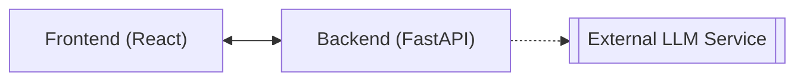

# DevOpsCool

An intelligent educational assistant designed to guide students through **DevOps** and **Cloud Computing** concepts in a **structured** and **interactive** way.

The system is centered around a **dynamic roadmap** that organizes topics as a **tree of learning paths**. Each node represents a subject, from foundational principles to advanced cloud architectures. As students navigate this roadmap, they can interact with the assistant to **explore ideas, clarify doubts, and receive explanations** adapted to their current topic.

The assistant uses a **language model** to act as a **tutor** — providing c**ontext-aware guidance, practical examples, and study suggestions**. Its goal is not only to teach isolated concepts but to help students connect them within the **broader ecosystem of modern cloud development and DevOps practices**.

By combining **conversational learning** with **structured progression**, **DevOpsCool** aims to transform technical education into a **guided, adaptive experience** where exploration and understanding evolve together.

> This project is inspired by and structured upon the [DevOps Roadmap](https://roadmap.sh/devops) by [roadmap.sh](https://roadmap.sh), which serves as the foundation for organizing topics and defining the learning flow.

## System Architecture

The architecture consists of two main components:

**Frontend (React):**
- Displays the roadmap and manages user interaction.
- Stores current topic and minimal chat context in localStorage.
- Communicates with the backend via REST endpoints.

**Backend (FastAPI):**
- Defines API endpoints for chat and topic management.
- Builds prompts (system and user) based on the current topic.
- Interacts with the selected LLM API.
- Returns formatted responses to the frontend.

## Frontend Concept

The frontend functions as an interactive study interface where the roadmap guides learning progression.  
Each node in the roadmap represents a specific subject area, and interacting with it changes the assistant’s response context.

### User Flow
**Initialization**  
1. User selects a topic from the roadmap.  
2. Frontend saves the topic in `localStorage`.  
3. Chat session is initialized with the backend.  

**Interaction**
1. User sends a message through the chat interface.  
2. Frontend forwards the message to the backend.  
3. Backend processes and returns a context-aware response.  
4. Frontend displays the assistant’s reply.  

**Continuation**
1. User continues the conversation or changes topic.  
2.  The loop repeats for dynamic learning.  
3.  User can reset the chat to start fresh.  

### Components

- **Roadmap Tree:** Visual representation of topics as a tree structure.
- **Chat Interface:** Area for user-assistant interaction.
- **State Management:** Uses localStorage to maintain current context.
- **API Communication:** Handles requests to the backend for chat responses.

### Style

Fonts

Color Palette

### Roadmap Structure

Refer to [roadmap_structure.md](./roadmap_structure.md)

