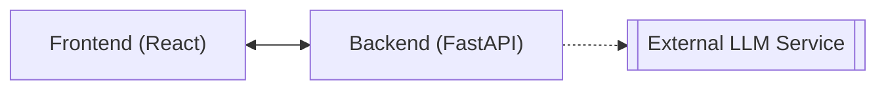

# DevOpsCool

An intelligent educational assistant designed to guide students through *Cloud Computing* and *DevOps* concepts in a structured and interactive way.

The system is centered around a dynamic roadmap that organizes topics as a tree of learning paths. Each node represents a subject, from foundational principles to advanced cloud architectures. As students navigate this roadmap, they can interact with the assistant to explore ideas, clarify doubts, and receive explanations adapted to their current topic.

The assistant uses a language model to act as a tutor — providing context-aware guidance, practical examples, and study suggestions. Its goal is not only to teach isolated concepts but to help students connect them within the broader ecosystem of modern cloud development and DevOps practices.

By combining conversational learning with structured progression, DevOpsCool aims to transform technical education into a guided, adaptive experience where exploration and understanding evolve together.

## System Architecture

The architecture consists of two main components:




**Frontend (React):**
- Displays the roadmap and manages user interaction.
- Stores current topic and minimal chat context in localStorage.
- Communicates with the backend via REST endpoints.

**Backend (FastAPI):**
- Defines API endpoints for chat and topic management.
- Builds prompts (system and user) based on the current topic.
- Interacts with the selected LLM API.
- Returns formatted responses to the frontend.


## Frontend Concept

The frontend functions as an interactive study interface where the roadmap guides learning progression.  
Each node in the roadmap represents a specific subject area, and interacting with it changes the assistant’s response context.

#### 

- **Core Components**
  - `RoadmapTree`: renders the topic hierarchy.
  - `ChatWindow`: displays the conversation with the assistant.
  - `ContextBar`: shows the active topic.
  - `AppContext`: manages global state (active topic, chat history).

- **Persistent State**
  - The active topic and chat history are stored in `localStorage` for continuity:
    ```js
    localStorage.setItem("activeTopic", "docker_basics");
    localStorage.setItem("chatHistory", JSON.stringify(messages));
    ```

- **Interaction Flow**
  1. User selects a topic in the roadmap.
  2. The frontend sends `{ topic, message }` to the backend `/chat` endpoint.
  3. The backend queries the LLM and returns a contextual response.
  4. The response is displayed in the chat and saved locally.

---

### 4. Backend Design

#### 4.1 Structure

The backend, built with FastAPI, acts as a bridge between the frontend and the language model API.  
It manages request validation, prompt construction, and response formatting.

#### 4.2 Main Endpoints

| Endpoint | Method | Description |
|-----------|---------|-------------|
| `/chat` | POST | Receives `{ topic, message }`, returns the model response |
| `/themes` | GET | Returns the roadmap topics and subtopics |
| `/health` | GET | Simple health check for ECS and CI/CD |

Schema example:

```python
from pydantic import BaseModel

class ChatRequest(BaseModel):
    topic: str
    message: str

class ChatResponse(BaseModel):
    topic: str
    answer: str
