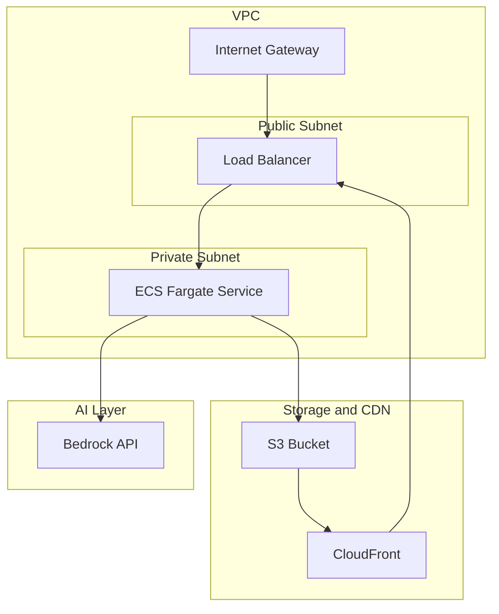
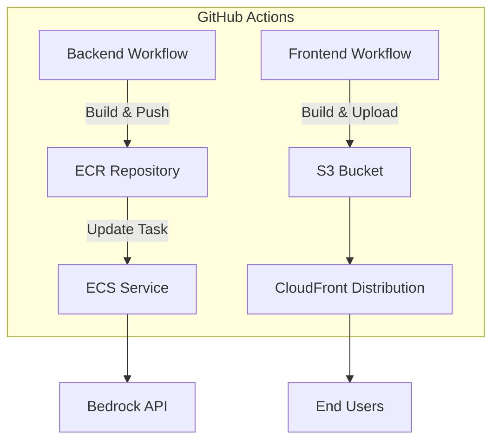

# DevOpsCool

An intelligent educational assistant designed to guide students through **DevOps** and **Cloud Computing** concepts in a **structured** and **interactive** way.

The system is centered around a **dynamic roadmap** that organizes topics as a **tree of learning paths**. Each node represents a subject, from foundational principles to advanced cloud architectures. As students navigate this roadmap, they can interact with the assistant to **explore ideas, clarify doubts, and receive explanations** adapted to their current topic.

The assistant uses a **language model** to act as a **tutor** — providing c**ontext-aware guidance, practical examples, and study suggestions**. Its goal is not only to teach isolated concepts but to help students connect them within the **broader ecosystem of modern cloud development and DevOps practices**.

By combining **conversational learning** with **structured progression**, **DevOpsCool** aims to transform technical education into a **guided, adaptive experience** where exploration and understanding evolve together.

> This project is inspired by and structured upon the [DevOps Roadmap](https://roadmap.sh/devops) by [roadmap.sh](https://roadmap.sh), which serves as the foundation for organizing topics and defining the learning flow.

## System Architecture

The architecture consists of two main components: a **React frontend** and a **FastAPI backend** powered by **AWS Bedrock** for LLM inference.


## Frontend

The frontend is a **React** single-page application built for **readability** and **comfort**, focusing on structured, Markdown-enhanced interaction.

### Key Responsibilities
- Display the **learning roadmap** and manage navigation.
- Handle **chat interaction** with backend via REST API.
- Render Markdown replies cleanly with **ReactMarkdown**, `remark-gfm`, and `rehype-sanitize`.
- Maintain minimal persistent state (`topicPath` and `messages`).

### Core Components

| Component | Purpose |
|------------|----------|
| `App.jsx` | Central logic: topic state, chat flow, and UI layout |
| `ChatWindow.jsx` | Markdown-based chat interface |
| `RoadmapTree.jsx` | Tree-view roadmap navigation |
| `api.js` | Backend communication via `fetch()` |


### API Endpoint (Frontend → Backend)
```
POST /api/chat
```

**Request:**
```json
{
  "topic": "CI/CD",
  "user_input": "How do pipelines work?"
}
```

**Response:**
```json
{
  "reply": "### Explanation\nContinuous Integration..."
}
```

### Roadmap Structure

Refer to [roadmap_structure.md](./roadmap_structure.md)


## Backend
The backend is built with **FastAPI** and serves as a lightweight orchestration layer between the frontend and the AWS **Bedrock Runtime API**.  
It handles chat requests, structures prompts, invokes the LLM securely, and returns consistently formatted Markdown responses.

### Core Architecture


Each interaction follows a stateless request–response cycle, keeping the system scalable and easy to deploy in containerized or serverless environments.


### Core Responsibilities
- Expose REST API endpoints for chat (`/api/chat`) and health checks (`/api/health`).
- Validate and structure input using Pydantic schemas.
- Compose contextual LLM prompts (system + user + topic context).
- Invoke AWS Bedrock securely through `boto3`.
- Parse and sanitize the model’s response before sending it back.

### Module Overview

| File | Responsibility |
|------|----------------|
| `main.py` | Application entrypoint — sets up CORS, middleware, and routes. |
| `routes_chat.py` | Defines `/api/chat` and `/health` endpoints. |
| `chat.py` | Pydantic models that define the schema for chat requests and responses. |
| `bedrock_client.py` | Manages prompt construction, LLM invocation, and response parsing. |


### Request Flow

1. **Frontend Request**  
   The user selects a topic or sends a message. The frontend issues a `POST` request to `/api/chat`:

   ```json
   {
     "topic": "Containers / Docker",
     "user_input": "How does Docker isolate applications?"
   }
   ```

2. **Routing and Validation**  
   FastAPI receives the request in `routes_chat.py`, validates it against the `ChatRequest` schema, and forwards the data to the core chat logic.

3. **Prompt Construction**  
   The backend builds a minimal but structured context:

   ```python
   messages = [
       {"role": "system", "content": SYSTEM_PROMPT},
       {"role": "assistant", "content": f"Current topic: {topic_path}"},
       {"role": "user", "content": user_input}
   ]
   ```

4. **LLM Invocation (Bedrock)**  
   The `bedrock_chat()` function uses the AWS Bedrock Runtime client `boto3.client("bedrock-runtime")` to invoke the **OpenAI OSS 120B** model (`openai.gpt-oss-120b-1:0`) through the Bedrock Runtime API, with configured parameters:

   ```python
   {
       "model": settings.BEDROCK_MODEL_ID,
       "messages": messages,
       "max_completion_tokens": 3000,
       "temperature": 0.65,
       "top_p": 0.9
   }
   ```

5. **Response Handling**  
   The response is read from the stream, parsed as JSON, cleaned of any hidden reasoning traces, and reduced to the final Markdown payload returned to the frontend.

6. **Frontend Rendering**  
   The React interface displays the structured Markdown output to the user.


### System Prompt

```
SYSTEM_PROMPT = """
You are DevOpsCool, a mentor that provides clear and structured explanations about DevOps and Cloud Computing.

Your task:
- Explain the given topic or answer the user's question logically and concisely.
- Focus on the concept and its purpose, not examples or opinions.
- Always respond in the format below:

### Explanation
### Summary
### Next Steps
"""
```

## DevOps

### Cloud Infrastructure

The system runs on **AWS** within a **VPC** that isolates compute and network resources.  
The **FastAPI backend** executes on **ECS Fargate** in private subnets and is exposed through an **Application Load Balancer (ALB)** configured with an **ACM TLS certificate** for HTTPS.  
Traffic is routed via the ALB’s DNS endpoint, while the **React frontend** is hosted on **S3** and distributed globally through **CloudFront**, also secured with HTTPS.  
Backend tasks communicate with **Amazon Bedrock** using `boto3`, authenticated by **IAM task roles** that provide scoped permissions for model invocation.




### CI/CD Pipeline

Two **GitHub Actions** workflows manage deployment from the `release` branch — one for the **backend**, one for the **frontend**.  
The backend workflow builds the FastAPI image, pushes it to **ECR**, and updates the **ECS Fargate** service.  
The frontend workflow builds the React app, uploads artifacts to **S3**, and invalidates **CloudFront** caches for immediate refresh.



**Backend Workflow**
1. Build Docker image from `backend/`.  
2. Push to Amazon ECR.  
3. Update ECS task definition and deploy the new revision.

**Frontend Workflow**
1. Build React app from `frontend/`.  
2. Sync `dist/` output to S3.  
3. Invalidate CloudFront cache for global content propagation.
   
